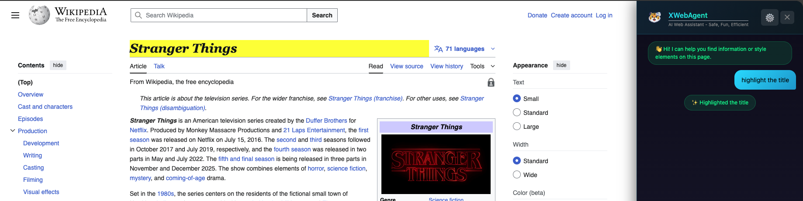

<p align="center">
  
</p>
<h1 align="center">XWebAgent Extension – A Chrome extension that makes browsing 
<b>Safe</b> 🛡️, <b>Fun</b> 😄, and <b>Efficient</b> 🚀</h1>

## Features
<div align="center">

| 🔍 Read | ✨ Write | 🎯 Guide | 🛡️ Guardian |Support|
|-|-|-|-|-|
|Extract information| Highlight links | Guided tasks <br> Visual cues | Phishing <br> U18 blocking <br> Domains | <br> |

</div>

## Examples
Example Site: https://en.wikipedia.org/wiki/Stranger_Things

Prompt: Highlight the title
<p align="center">
  
</p>
Result: The title "Stranger Things" are highlighted in Yellow.

## Installation

### Developer Mode (for testing)

1. Open Chrome and go to `chrome://extensions/`
2. Enable **Developer mode** (toggle in top right)
3. Click **Load unpacked**
4. Select the `XWebAgent-Extension` folder
5. The extension icon should appear in your toolbar

## Configuration
Create config.js that store the API keys:
```
// DO NOT COMMIT THIS FILE
const CONFIG_KEYS = {
  GEMINI_KEY: "......",
};

```
OR,

1. Click the extension icon
2. Click **Settings** (gear icon at bottom)
3. Enter your API key (now only support Gemini)

## Usage

### Ask Anything
Type a question in the chat box to find information on the current page.

## Project Structure

```
XWebAgent-Extension/
├── manifest.json           # Extension configuration
├── config.js
├── content/
│   ├── prompts.js         # LLM system prompts & keywords
│   └── utils.css          # Page analysis helpers
│   └── styling.css        # CSS injection & element styling
│   └── api.css            # Gemini API communication
│   └── chat.css           # Chat panel UI & user interaction
│   └── content.css        # Entry point & message handler
├── background/
│   └── service-worker.js  # Background tasks & API calls
├── options/
│   ├── options.html       # Settings page
│   └── options.js         # Settings logic
└── icons/
    ├── icon16.png
    ├── icon48.png
    └── icon128.png
```


## New features in V2
1. The LLM reads (almost) everything on the website.

2. Scroll to the highlighted location.
