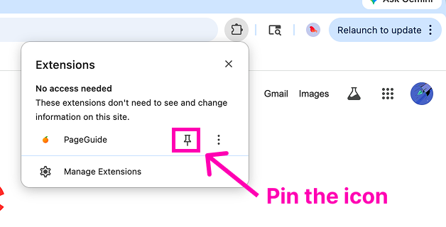
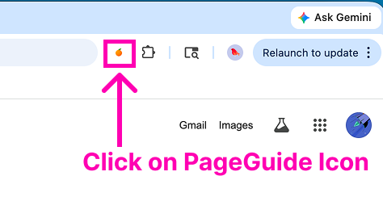
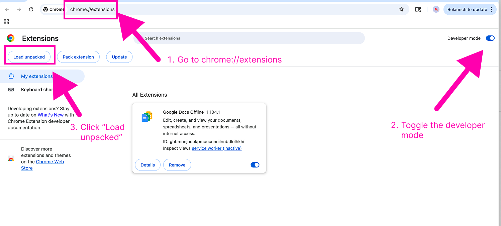
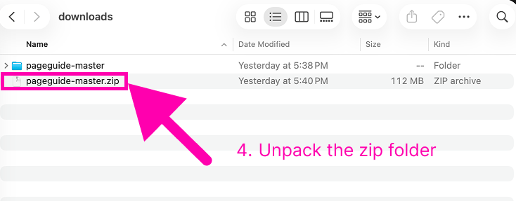
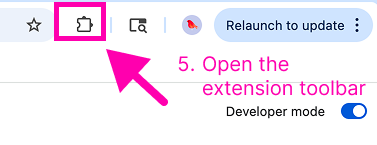
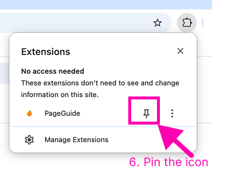
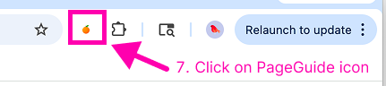

> **Note:** This is a temporary, anonymized copy of the README prepared for
> double-blind review. Author names, affiliations, personal and institutional
> URLs, the Chrome Web Store listing, the GitHub repository, and dataset
> account handles have been removed for the review period.

<p align="center">
  
</p>

# 🍊 PageGuide: Browser Extension to Assist Users in Navigating a Webpage and Locating Information

<p align="center">
  <em>Author names and affiliations omitted for anonymous review.</em>
</p>

<p align="center">
  
  &nbsp;
  
  &nbsp;
  
</p>

---

<div align="center">

<br/>

Support  Chrome &nbsp;&nbsp;  Edge

</div>

---

## ✨ Features

<p align="center">
  <a href="#feat-find"><kbd>🔍 Find</kbd></a> &nbsp;
  <a href="#feat-guide"><kbd>🎯 Guide</kbd></a> &nbsp;
  <a href="#feat-hide"><kbd>🛡️ Hide</kbd></a> &nbsp;
  <a href="#feat-answer"><kbd>💬 Answer</kbd></a> &nbsp;
  <a href="#feat-image"><kbd>🖼️ Image</kbd></a> &nbsp;
  <a href="#feat-pdf"><kbd>📄 PDF</kbd></a>
</p>

<br/>

<a id="feat-find"></a>

### 🔍 Find — Highlight the answer on the page

Have a question about something buried on a long page? PageGuide reads the page and highlights the exact text that answers your question — no manual scrolling needed.

**How to use:**

1. Open any webpage and click the PageGuide icon in your toolbar to open the side panel.
2. Make sure the **Page** toggle is **On** (the default).
3. Type your question in plain English, e.g. _"What is the return policy?"_ or _"Where is the contact email?"_
4. PageGuide highlights the relevant section on the page and shows you the answer in the panel.

<p align="center">
  
</p>

---

<a id="feat-guide"></a>

### 🎯 Guide — Walk through any task step by step

Not sure how to complete a task on an unfamiliar site? PageGuide overlays live instructions directly on the page, highlighting the exact button or field to interact with at each step.

**How to use:**

1. Navigate to the site where you want to complete a task.
2. Open PageGuide from the toolbar.
3. Ask a "how to" question, e.g. _"How do I change my password?"_ or _"How do I export this spreadsheet as a PDF?"_
4. PageGuide displays step-by-step instructions on the page. Each step highlights the exact element — click it, or let PageGuide auto-fill text fields and navigate for you.
5. Confirm each step at your own pace; PageGuide waits for you and resumes on the next page if navigation is needed.

<p align="center">
  
</p>

---

<a id="feat-hide"></a>

### 🛡️ Hide — Remove distracting content instantly

Cluttered with ads, cookie banners, or sidebars? Describe what you want gone and PageGuide removes it without refreshing the page.

**How to use:**

1. Open any webpage with unwanted content.
2. Open PageGuide from the toolbar.
3. Type what you want to remove, e.g. _"Hide all ads and the sidebar"_ or _"Remove the cookie banner."_
4. PageGuide detects the matching elements and makes them disappear instantly.

<p align="center">
  
</p>

---

<a id="feat-answer"></a>

### 💬 Answer — Ask general knowledge questions

Need a quick fact that has nothing to do with the current page? Switch PageGuide into general-knowledge mode and ask anything.

**How to use:**

1. Open PageGuide from the toolbar.
2. Toggle **Page** to **Off** in the side panel (this tells PageGuide to ignore the current page).
3. Type any question, e.g. _"What is the capital of France?"_ or _"Explain what a p-value means."_
4. PageGuide answers from its AI knowledge base directly in the panel.

---

<a id="feat-image"></a>

### 🖼️ Image Asking — Search the page with a picture

Have a screenshot or product image and want to find the matching item on the current page? Upload it and ask.

**How to use:**

1. Navigate to the page you want to search visually.
2. Open PageGuide from the toolbar.
3. Click the **📎** attachment icon in the chat bar, or paste an image directly with **Ctrl/Cmd+V**.
4. Type your question alongside the image, e.g. _"Find this product on the page"_ or _"Where is this button?"_
5. PageGuide compares your image against the page and highlights the matching element.

<p align="center">
  
</p>

---

<a id="feat-pdf"></a>

### 📄 PDF Asking — Ask questions about any PDF

Reading a long PDF in the browser? Ask questions and PageGuide finds the relevant passage without you having to read the whole document.

**How to use:**

1. Click the **📄 PDF** button in the toolbar.

2. Add your PDF in one of three ways:
   - Drag and drop the PDF file.
   - Click the upload button and select a file.
   - Paste a PDF URL into the input field.

3. Ask a question about the document, such as:
   - _“What is the main finding?”_
   - _“Summarize Section 3.”_

4. PageGuide reads the PDF and answers your question with cited evidence.

5. Click the citation to jump to the highlighted passage directly in the PDF viewer.

<p align="center">
  
</p>

---

## 🚀 Quick Start — One Click Installation 

Get PageGuide up and running in seconds. No configuration needed to start exploring!

### Step 1: Install from Chrome Web Store

Click the button below to install PageGuide directly to your browser:

<p align="center">
  <em>Chrome Web Store link withheld during anonymous review — please use the manual installation instructions below.</em>
</p>

The extension will automatically download and install. You'll see a confirmation notification in your browser.


### Step 2: Pin the Icon to Your Toolbar

Once installed, pin PageGuide to your toolbar for quick access:

<p align="center">
  
</p>

**How to pin:**
- Look for the puzzle piece icon  in your browser's top-right corner
- Click it to reveal all installed extensions
- Find PageGuide and click the pin icon next to it
- The PageGuide icon will now appear in your main toolbar for easy access


### Step 3: Start Using PageGuide

Click the PageGuide icon in your toolbar to open the side panel and begin:

<p align="center">
  
</p>

**You're ready to go!** Try one of these:
- 🔍 Ask a question about the current page, e.g., _"What is the return policy?"_
- 🎯 Get step-by-step instructions, e.g., _"How do I export this as a PDF?"_
- 🛡️ Hide unwanted content, e.g., _"Remove all ads and popups"_
- 🖼️ Upload an image to search visually
- 💬 Toggle **Page: Off** to ask general knowledge questions

---

### ⚙️ First-Time Setup

Before you can start using PageGuide, configure your LLM provider:

1. **Open Settings:** Click the ⚙️ gear icon in the top-right corner of the side panel
2. **Choose a Provider:** Select from:
   - **Google Gemini** (free tier available)
   - **OpenAI** (requires API key)
   - **OpenRouter** (aggregates multiple models)
3. **Enter Your API Key:** Paste your API key into the field
4. **Test Connection:** Click **Test & Save Connection** to verify your setup
5. **Done!** Your configuration is saved and ready to use

👉 **Need an API key?** Check the provider's website for setup instructions.


### 💡 Pro Tips

- **Pin to quick access:** Keep the extension icon pinned in your toolbar (see Step 2)
- **Keyboard shortcut:** You can set a custom keyboard shortcut in `chrome://extensions/shortcuts`
- **Privacy:** Your API key is stored only in your browser and never shared with us

---

## 🛠️ Manual Installation

### Developer Mode (for testing)

1. **Download**

- Download the latest zip file from the anonymized supplementary material (`master` branch).

2. **Install**

- Open Chrome and go to `chrome://extensions/`
- Enable **Developer mode** (toggle in top right)
- Click **Load unpacked**
  <p align="center">
    
  </p>
- Select the `pageguide` folder from the downloaded and unpacked zip file
  <p align="center">
    
  </p>
- Click Extension icon
  <p align="center">
    
  </p>
- Pin the extension icon to your toolbar
  <p align="center">
    
  </p>
- Use the extension by clicking the icon in the toolbar
  <p align="center">
    
  </p>

3. **Upgrading**

- Download the latest zip file from the anonymized supplementary material
- Unzip and replace the existing `pageguide` folder.
- Reload the extension in `chrome://extensions/` by clicking the reload button on the extension card.

---

## 🌐 Browser Support

- Chrome  - Full support with all features
- Edge  - Full support with all features

Not Supported:

- Firefox, Safari.

---

## ⚙️ Configuration

1. Click the extension icon to open the side panel
2. Click the **⚙️ Settings** (gear icon) at the top right corner of the side panel
3. Choose your LLM provider and enter your API key (support Gemini, OpenRouter, and OpenAI providers)
4. Click **Test & Save Connection** to validate your key
5. Optionally configure:
   - **Vision (Screenshot)** — enable/disable visual analysis (default: on)
   - **Show Element Indices (SoM)** — display numbered badges on page elements (default: off)

---

## 💡 Use Case

### Quick Reference

| What you want     | What to type                                            |
| ----------------- | ------------------------------------------------------- |
| Find info on page | `What is the return policy?`                            |
| Step-by-step task | `How do I change my password?`                          |
| Hide distractions | `Hide all ads and sidebars`                             |
| General knowledge | _(toggle Page: Off)_ `What is the capital of France?`   |
| Search by image   | _(upload image via 📎)_ `Find this product on the page` |
| Ask about a PDF   | _(open PDF)_ `Summarize section 3`                      |

---

## 📊 Research & Dataset

PageGuide was evaluated in a controlled within-subjects user study. All data and task stimuli are publicly available on HuggingFace.

### User Study

| Property     | Value                                                       |
| ------------ | ----------------------------------------------------------- |
| Design       | Counterbalanced within-subjects                             |
| Participants | ~47                                                         |
| Conditions   | `extension` (PageGuide active) vs. `control` (no extension) |
| Task types   | `find` · `guide` · `hide`                                   |
| Metrics      | Completion time, answer correctness, 7-point Likert survey  |

Each participant completed all three task types in both conditions. Condition order was counterbalanced to control for learning effects.

**Results summary**

| Task  | n   | Control (s) | Extension (s) | Δ (s) | p (Wilcoxon) |
| ----- | --- | ----------- | ------------- | ----- | ------------ |
| find  | 86  | 81.1        | 70.8          | −10.3 | 0.094        |
| guide | 85  | 76.2        | 109.3         | +33.1 | < 0.001 ✱    |
| hide  | 82  | 80.3        | 45.2          | −35.1 | < 0.001 ✱    |

✱ Statistically significant at α = 0.05.

**Post-study survey (7-point Likert, n ≈ 47)**

| Task  | Difficulty without PageGuide | Ease with PageGuide | Accuracy with PageGuide |
| ----- | ---------------------------- | ------------------- | ----------------------- |
| Find  | 4.4 / 7                      | 5.7 / 7             | 6.0 / 7                 |
| Guide | 4.8 / 7                      | 5.6 / 7             | 5.5 / 7                 |
| Hide  | 5.5 / 7                      | 5.9 / 7             | —                       |

### Datasets

---

**`pageguide_userstudy`**

- **Purpose:** Raw interaction logs from the user study — completion times, chat transcripts, correctness labels, paired statistical results, and post-study survey responses.
- **Used in:** Section 5 (User Study / Evaluation)
- **Download:** 🤗 `pageguide_userstudy` — released upon acceptance

```python
from datasets import load_dataset
tasks  = load_dataset("anonymous-authors/pageguide_userstudy", data_files="tasks.csv", split="train").to_pandas()
paired = load_dataset("anonymous-authors/pageguide_userstudy", data_files="paired_times.csv", split="train").to_pandas()
```

---

**`pageguide_find_data`**

- **Purpose:** Task stimuli for the **Find** condition — 10 real webpages (NASA, Wikipedia, Cleveland Clinic, WWF, Britannica, JMLR) each annotated with up to 2 factual questions, ground-truth answers, and supporting evidence spans.
- **Used in:** Section 5.1 (Find Task Setup)
- **Download:** 🤗 `pageguide_find_data` — released upon acceptance

```python
find_tasks = load_dataset("anonymous-authors/pageguide_find_data", split="train").to_pandas()
```

---

**`pageguide_guide_data`**

- **Purpose:** Task stimuli for the **Guide** condition — 7 procedural tasks across 6 platforms (Google Sheets, Google Docs, Google Slides, Coda, TradingView, Scratch), labelled Easy or Medium difficulty.
- **Used in:** Section 5.2 (Guide Task Setup)
- **Download:** 🤗 `pageguide_guide_data` — released upon acceptance

```python
guide_tasks = load_dataset("anonymous-authors/pageguide_guide_data", split="train").to_pandas()
```

---

**`pageguide_hide_data`**

- **Purpose:** Task stimuli for the **Hide** condition — 37 annotated webpage snapshots (Amazon, Netflix, TechCrunch, Allrecipes, Spotify, Yelp, and more) with `(user_goal, hide_query, difficulty, hidden_elements)` annotations and ground-truth CSS selectors. HTML snapshots available on an anonymized file-sharing link provided with the submission.
- **Used in:** Section 5.3 (Hide Task Setup)
- **Download:** 🤗 `pageguide_hide_data` — released upon acceptance

```python
hide_tasks = load_dataset("anonymous-authors/pageguide_hide_data", split="train").to_pandas()
```

---

## 🤝 Contributing

Contributions are welcome! To get started:

1. Fork the repository and create a feature branch (`git checkout -b feat/your-feature`)
2. Make your changes — keep PRs small and focused on a single concern
3. Ensure all tests pass: `npm run ci`
4. Submit a pull request with a clear description of what and why

Please follow the rules in [CLAUDE.md](CLAUDE.md); open an issue first for larger changes so we can align on the approach.

### 🧪 End-to-End Tests

We use Playwright to run end-to-end (E2E) tests, integrated with automated continuous integration (CI) via GitHub Actions. The CI pipeline runs whenever a commit is pushed to the `main` branch or a pull request targeting `main` is opened or updated, invoking `npm run ci` to execute the full test suite.
The E2E tests verify that the extension loads correctly, its UI pages render and respond to user actions, content scripts behave on real-world pages, and common edge cases do not cause failures.

To run the tests locally, use the following command:

```bash
npm run ci
```

---

## 🙏 Acknowledgements

PageGuide is built on top of some great open-source tools and APIs:

- [Playwright](https://playwright.dev/) — end-to-end testing
- [Chrome Extensions API (Manifest V3)](https://developer.chrome.com/docs/extensions/mv3/) — extension platform
- LLM providers: [Google Gemini](https://ai.google.dev/), [OpenAI](https://openai.com/), [OpenRouter](https://openrouter.ai/)

---

