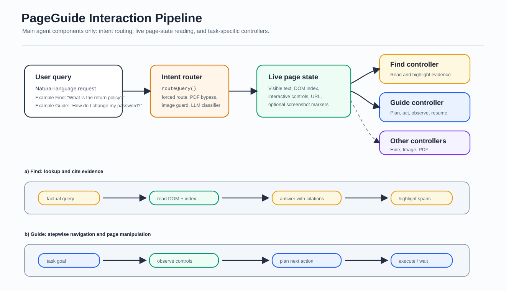
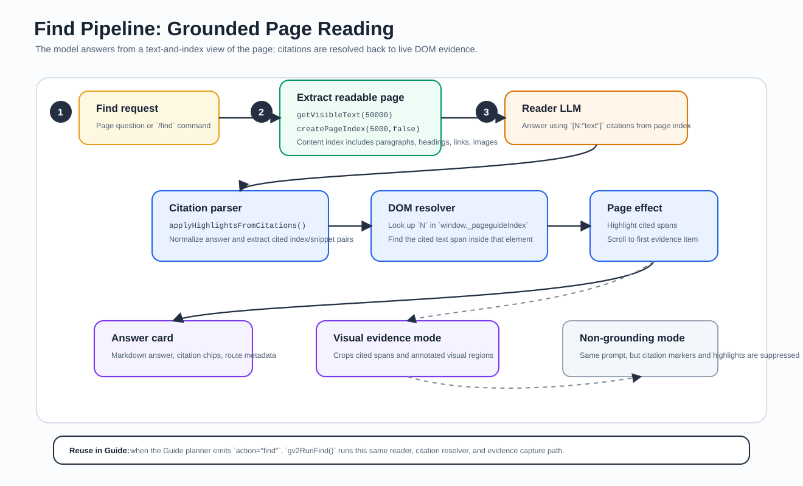
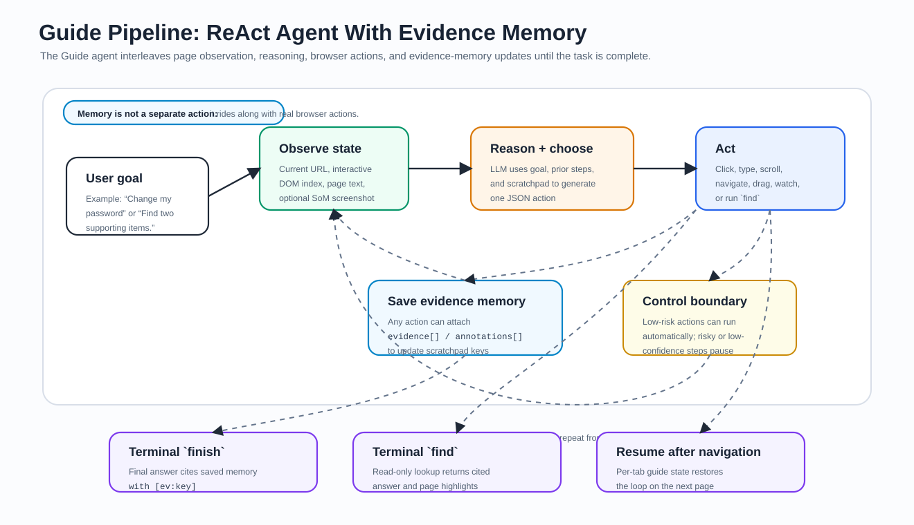

# Method Figures

This folder contains method-section figures for PageGuide's browser-extension web agent. The set is intentionally compact: one interaction overview plus focused drill-downs for Find and Guide.

## Figure 1. Interaction pipeline

Given a user query, PageGuide routes intent, reads the live page state, and dispatches to a task controller. Find tasks return grounded answers with highlighted evidence; Guide tasks iteratively plan and execute page actions until a terminal state is reached. Other handlers, such as Hide, Image, and PDF, share the same routing and page-state layer but are collapsed here to keep the method figure focused.

Primary code anchors: `sidepanel/panel.js`, `content/content.js`, `content/functions/main_router.js`, `content/prompts.js`.

## Figure 2. Find pipeline

Find is implemented as a grounded reader. PageGuide extracts visible text and a numbered DOM index, optionally adds screenshot evidence, asks the model for an answer with `[N:"text"]` citations, resolves citations back to DOM nodes, highlights cited spans, and returns evidence-linked answer cards. Guide's `action="find"` reuses this same reader.

Primary code anchors: `content/tasks/ask.js`, `content/tasks/guidev2.js`, `content/utils.js`, `content/functions/highlight.js`.

## Figure 3. Guide pipeline

Guide follows a ReAct-style loop with memory: observe the current page state, reason over the goal and scratchpad, generate one browser action, execute or hand off the action, optionally save evidence, and repeat from the updated page state. Saved evidence and annotations are written into the scratchpad and cited later with `[ev:key]` in the final answer.

Primary code anchors: `content/tasks/guidev2.js`, `content/prompts.js`, `background/service-worker.js`, `rewind/rewind_store.js`.
